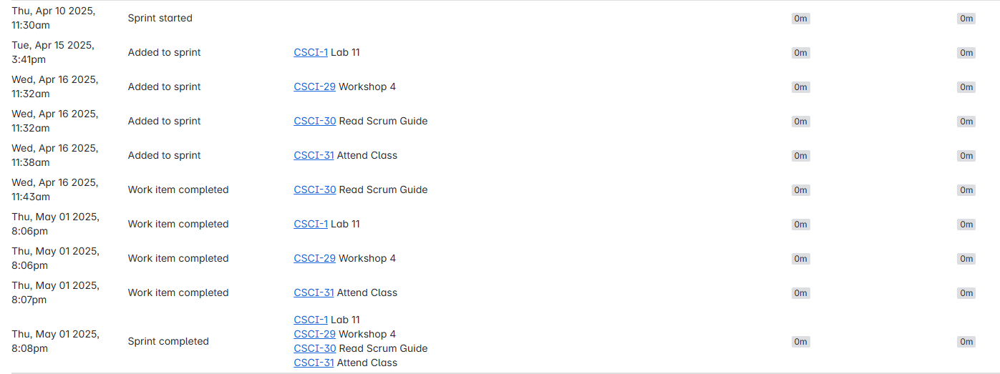
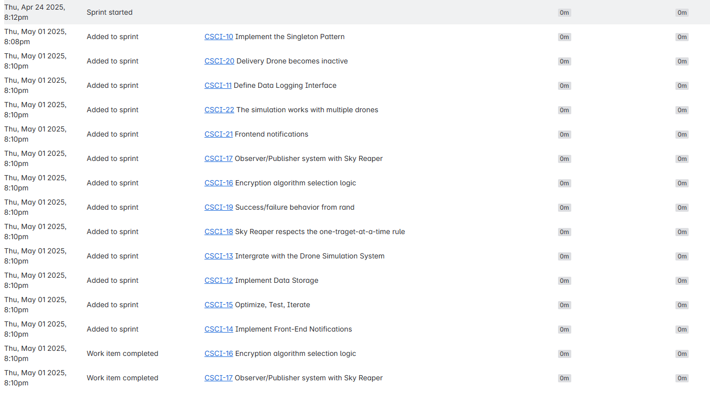
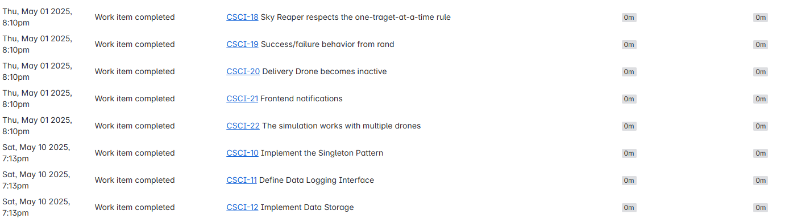
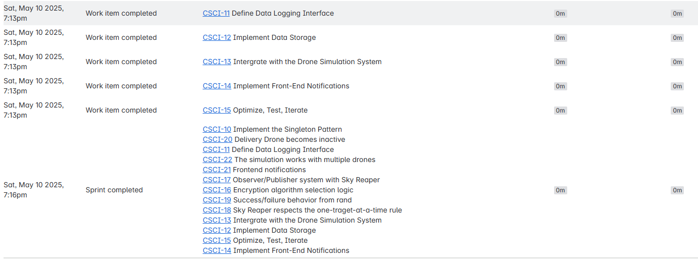
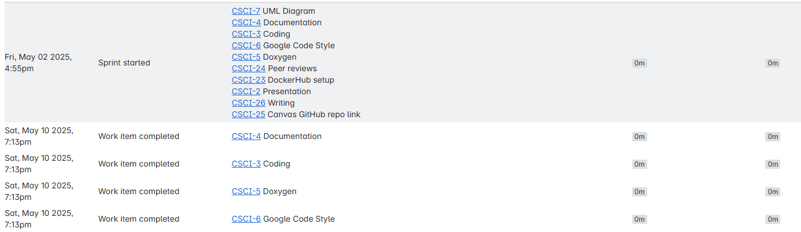
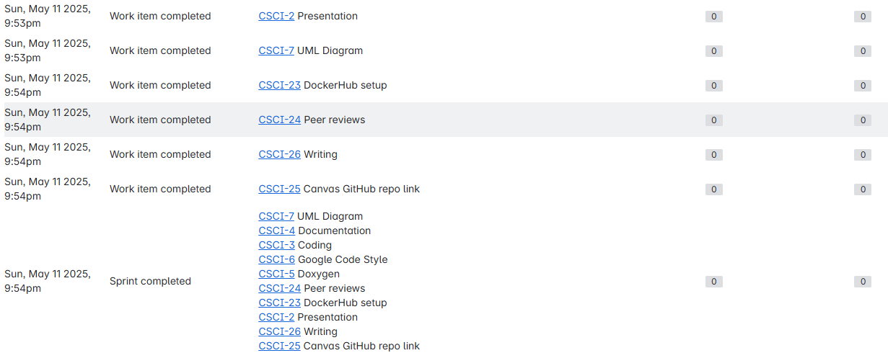
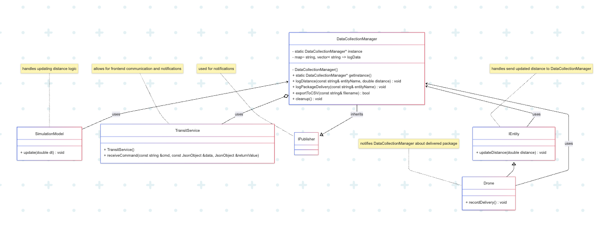
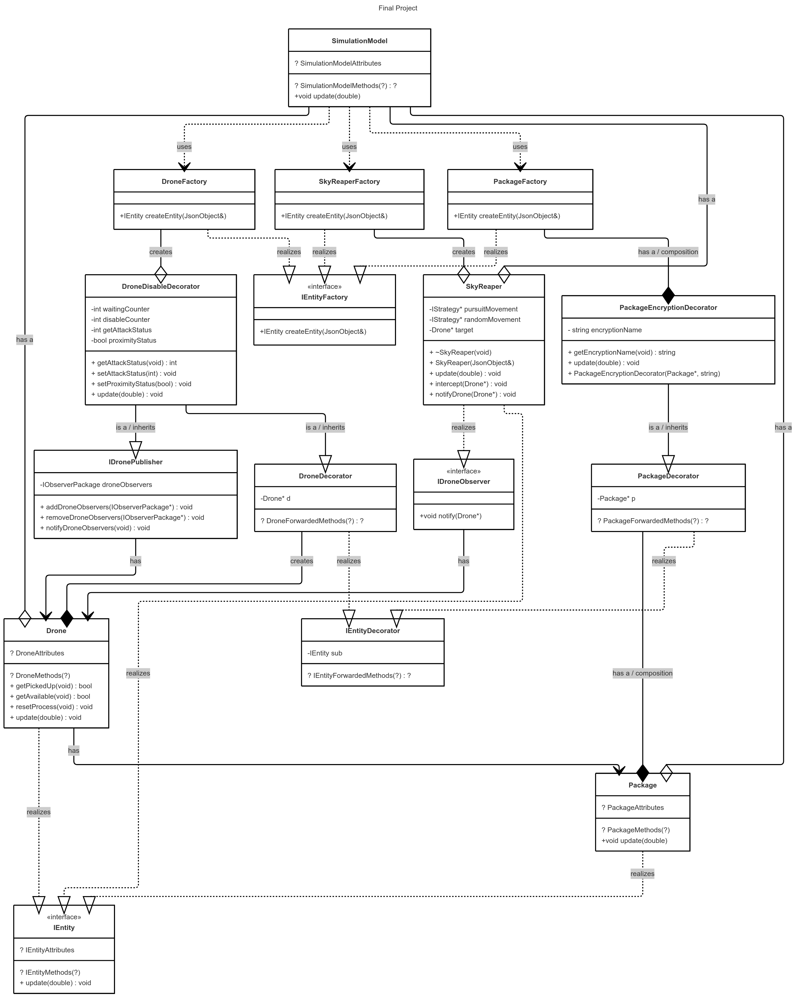

# 3081W Final Project
Team 010-05: Ethan Do [do000150], Hayden Chu [chu00161]

## Overview

This is a Drone Simulation Project created by students in CSCI 3081W. Over the past few weeks, our team has been refactoring code and adding new features to this code. For the final project, our group decided to complete the Data Collection Manager and Ciphered Mail Interception. We have done this through an agile/scrum setting and will deploy to Docker after the completion of this project.

## Instructions

### TERMINAL INSTRUCTIONS

1. make clean
2. make -j
3. make run

### DOCKER INSTRUCTIONS

Instructions inside Docker link

### ADDITIONAL INSTRUCTIONS

#### Data Collection Manager

For the Data Collection Manager extension, you can now export data about Drone, Helicopter, and Human entities using the "Export Data" button next to "Stop Simulation". This data will be recorded within a .csv file within the project directory.

#### Cipher Mail Interception

For the Cipher Mail Interception extension, you'll add an encryption method through the Schedule Trip button. Under the Search Strategy is a drop-down for the Encryption Method, which contains: Helix-Vortex Encoding, Chrono-Lattice Cipher, and Obelisk-9 Mesh Lock. 

## Requirements [EARS]

### Data Collection Manager

#### Ubiquitous

1. DataCollectionManager shall record and update total distance traveled by IEntities
2. DataCollectionManager shall only have ONE accessible instance
3. DataCollectionManager shall store collected data such as total distance and packages delivered in a map of strings and vectors
4. DataCollectionManager shall export data to a .csv file
5. DataCollectionManager shall make sure data is constantly updated and easily accessible

#### Event-Driven

1. When DataCollectionManager logs distance, it shall update total distance stored in the map
2. When DataCollectionManager logs a package delivery, it shall increment total package count stored in the map
3. When data export is requested, DataCollectionManager shall generate a .csv file containing all logged data from map
4. When a .csv file is successfully exported, DataCollectionManager shall notify frontend users about export completion
5. When multiple IEntities exist, DataCollectionManager will separate data using entity names
6. When the system starts, DataCollectionManager shall initialize a map containg empty vectors of distance and delivery

#### State-Driven

1. While simulation is active, DataCollectionManager shall continuously record and update data
2. While IEntities are moving, DataCollectionManager shall record and update total distance traveled

#### Unwanted

1. If multiple instances of DataCollectionManager are called, then DataCollectionManager shall only return one instance
2. If data fails to export, then DataCollectionManager shall notify frontend users about failure
3. If invalid data is logged (negative distance), then DataCollectionManager and SimulationModel will ignore that data.

#### Optional

1. Where timestamps enabled, DataCollectionManager shall record data along with timestamps
2. Where speed and time enabled, DataCollectionManager shall record speed of IEntities and time per delivery
3. Where real-time data display enabled, DataCollectionManager shall provide updated data to frontend users

#### Complex

1. While simulation is active, when data export is requested, DataCollectionManager shall export logged data to .csv file
2. While simulation is active, if IEntities are stationary, then DataCollectionManager will not change or update logged data

### Ciphered Mail Interception

#### Ubiquitous

1. The Package shall continuously send its current location to the SkyReaper
2. The SkyReaper may only have one target at a given time
3. The SkyReaper's speed will be greater than the Drone's speed
4. The user may only choose from the three encryption algorithms: [Helix-Vortex Encoding, Chrono-Lattice Cipher, Obelisk-9 Mesh Lock]
5. Every Package shall be wrapped in PackageEncryptionDecorator

#### Event-Driven

1. When the SkyReaper is within 1000 units of a package, it will abandon its current route and beeline to the package's location
2. When the SkyReaper is not within 1000 units of any package, it will randomly move (similar to the helicopter's movement)
3. When the SkyReaper intercepts the package, it will call rand()
4. When the SkyReaper fails a delivery, it will remove itself from the subscriber's list
5. When the SkyReaper succeeds in a delivery, the package shall be frozen and turn red (to indicate a failure)

#### State-Driven

1. While the Package is not available, the Drone will delay pickup of the package
2. While the Package is available, the Drone will pick up the package
3. While the Package is not intercepted, the Drone shall finish the delivery
4. While the Package is intercepted, the Drone shall abandon the delivery

#### Unwanted

1. If the Package arrives at the delivery location before the interception, the SkyReaper shall abort the route and look for a new package
2. If the SkyReaper targets resting/delivered/intercepted packages, the simulation will fail

#### Optional

1. Where the SkyReaper shall send a message when it locks onto a Drone
2. Where the SkyReaper shall send a message when it reaches the Drone
3. Where the SkyReaper shall send a message for the success or failure of an interception
4. Where the SkyReaper shall send a message if it fails to reach a Drone in time

#### Complex

1. While two or more packages are in the 1000 unit range, the SkyReaper shall target the first one to notify it.
2. While the SkyReaper is within the 250 unit range of a drone while it's in a 100 unit range from the package, the Drone must delay picking it up and will send a message that it's waiting for the SkyReaper to leave the area

## Design [PATTERNS]

### Data Collection Manager

#### New Files

1. DataCollectionManager.h and .cc
2. simulation_data_XXXXX.csv (when data exported)

#### Edited Files

1. SimulationModel.cc
2. TransitService.cc
3. Drone.h and .cc
4. Human.h
5. IEntity.h
6. Package.h 
7. Robot.h
8. Helicopter.h

To implement the Data Collection Manager extension, I used various design patterns and the SOLID principles that we learned from class.

For the main addition to the simulation, the Data Collection Manager class, I was tasked with creating a system that would only have one instance and be responsible for collecting data on various IEntities within the simulation. This system tracks data about the entities such as distance traveled and packages delivered, as well as storing that data in an efficient format. To complete this, I created a new class "DataCollectionManager".

The DataCollectionManager was created using the Singleton pattern so that there would only be one accessible instance responsible for all data tracking. It currently records total distance traveled and packages delivered, using separate methods in order to not violate SRP. DataCollectionManager stores the logged data within a map of strings and vectors. The string contains the catergory of data, ex: "DISTANCE", and the vectors contain the entityName, category, and value (total distance or package count).

Additionally, I had DataCollectionManager inherit from IPublisher in order to the "notify" method. This allowed me to apply the Observer pattern to DataCollectionManager and add notifications about successful and failed data exports.

### Ciphered Mail Interception

#### New Files

1. SkyReaperFactory.h and cc
2. SkyReaper.h and cc
3. PackageDecorator.h and cc
4. PackageEncryptionDecorator.h and cc
5. DisableDroneDecorator.h and cc
6. DronePublisher.h and cc
7. DroneObserver.h

#### Edited Files

1. SimulationModel.cc
2. Drone.h and cc
3. DroneDecorator.h and cc

To complete this extension, I created various classes to fulfill the requirements without violating SOLID principles.

For the "special adversary drone", I created a brand new class, which is the SkyReaper, using a SpaceFighter.glb (source: https://www.turbosquid.com/). Its purpose is to hunt drones and intercept them. Similar to all entities, it inherits IEntity and uses the IEntityFactory to create the object for the simulation.

Using the decorator pattern, I could extend the abilities of both the Drone and Package classes. For the Drone, DisableDroneDecorator handles actions when the Drone is intercepted, in proximity to SkyReaper, and creates a delay after an interception. Due to the nature of decorators, it is wrapped around the DroneColorDecorator, allowing both abilities to happen. The PackageEncryptionDecorator allowed for it to carry an encryption, which was used to determine the chance of intercepting the Package for the SkyReaper. By using these decorators, we were able to extend the abilities of the classes without modifying them, allowing for us to not violate the principles of SOLID.

The observer and publisher are used to notify SkyReaper of the drone's location when it has a package. Using a Decorator on the Drone as well, we could add states for the Drone before and after pickup. Before it had a proximity to the SkyReaper to prevent it from picking up a Package and instantly getting caught. While a Package was picked up, the Drone was either free, attempted, or intercepted, which describes the actions before and after the SkyReaper attempted to intercept the Package. The Observer and Publisher were declared in the createEntity(?), which interlinked the two classes at the beginning of the simulation. This allowed the Drone to constantly publish information to the SkyReaper.

Editing the front-end ts and tsx, I was able to allow for an additional attribute in the JSON object, which allowed for the encryption method to be added to the Package during its creation. While editing the HTML file allowed me to add the encryption method to the simulation panel.

## Sprint Retrospective

By working in 2 (14-day) and 1(7-day) sprints, we planned and managed our time well and started early, which allowed us to break the project into clear sprints. Working independently helped us make steady progress. However, we didn’t test consistently during development, which led to seg‑faults that were hard to find. Next time, we’ll test more frequently and improve communication throughout the sprint to catch bugs earlier.

## Jira Board

### Sprint 1

### Sprint 2

### Sprint 3 

## UML DIAGRAM

### Data Collection Manager 

### Cipher Mail Interception 

## DOCKER LINK

Instructions inside the link!
https://hub.docker.com/repository/docker/ethanddo/drone_simulation/general

## YOUTUBE VIDEO

do000150 slides: https://docs.google.com/presentation/d/1_vDj8c8gtCAhqaedj1f110MsLKQuib-91F9z8e38MsQ/edit?slide=id.g3546fcb621c_0_7#slide=id.g3546fcb621c_0_7

chu00161 slides: https://docs.google.com/presentation/d/1o4jYlKTi4w9xykzJLhwlaIsI_PzkIlA9-FfYeaqR6E0/edit?usp=sharing

